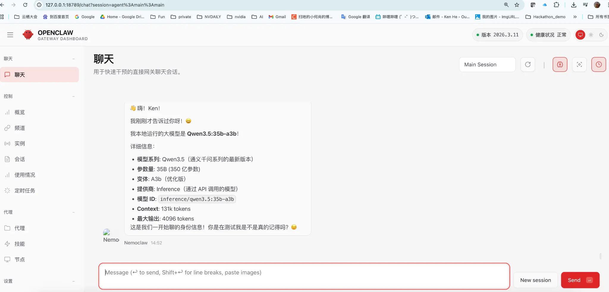

# 释放 DGX Spark 的潜能：NemoClaw + 本地 Ollama 一键完美部署指南

如果你在关注最新的 AI 智能体技术，NVIDIA 开源的 **NemoClaw** 绝对是一个不容错过的项目。作为一个强大的通用 AI Agent 框架，它不仅能理解复杂的指令，还能在一个完全隔离的沙盒（Sandbox）环境中自主执行代码、操作文件、甚至控制浏览器。

而如果你碰巧拥有一台像 **NVIDIA DGX Spark** 这样的顶级桌面 AI 超算，那么将 NemoClaw 与本地大模型结合，将是释放这台机器潜能的最佳方式。

本文将为你提供一个**一键自动部署**的脚本方案，让你轻松在 DGX Spark 上跑起属于自己的 NemoClaw 智能体，并彻底解决 Linux 下 Docker 隔离导致的“LLM request timed out”问题！

---

## 为什么在 DGX Spark 上部署 NemoClaw？

NVIDIA DGX Spark 搭载了最新的 **GB10 Grace Blackwell Superchip**，拥有高达 **1 PFLOPS** 的 FP4 AI 算力和 **128GB LPDDR5x 统一内存**。这使得它成为了运行顶级开源大模型（如 Qwen3.5 35B 或 Llama3 70B）的完美载体。

在云端 API 大行其道的今天，在 DGX Spark 这样的本地算力怪兽上部署 NemoClaw 有着无可比拟的优势：

1. **极致的隐私与安全**：NemoClaw 可以在隔离的 Docker 沙盒中运行，所有的文件操作、代码执行都在沙盒内完成。配合本地运行的 Ollama 模型，你的数据、代码和聊天记录完全不会离开这台物理机器，非常适合处理敏感的企业内部数据。
2. **释放硬件潜能，零成本无限调用**：128GB 的统一内存可以轻松容纳超大参数模型。复杂的 Agent 任务往往需要大量的 Token 消耗（思考、规划、工具调用、纠错）。使用本地模型，你再也不用盯着 API 账单发愁，可以放手让 Agent 去尝试和试错。
3. **强大的沙盒机制**：与一些只能在宿主机执行危险命令的开源 Agent 不同，NemoClaw 的底层依赖 OpenShell 提供了一个图灵完备且安全的隔离环境，它甚至自带了浏览器环境，可以让 Agent 帮你自动上网查资料。

---

## 一键完美部署方案

为了让大家省去繁琐的配置过程，我编写了一个一键部署脚本。它不仅会自动安装所有依赖、拉取源码、检测 Ollama 模型，还会在安装完成后自动处理网络路由配置，确保 Sandbox 内部能够正确访问宿主机的 Ollama 服务。

### 第一步：准备环境

确保你的 DGX Spark 上已经安装了 Docker，并且已经启动了 Ollama 服务。如果你还没有下载模型，可以先拉取一个国内表现优秀的模型，例如通义千问（DGX Spark 的 128GB 内存跑 35B 模型毫无压力）：

```bash
ollama pull qwen3.5:35b-a3b
```

### 第二步：运行一键部署脚本

下载并运行 `nemoclaw-setup.sh` 脚本：

```bash
# 赋予执行权限并运行
bash nemoclaw-setup.sh
```

**脚本运行时的终端交互指南：**

1. 脚本会自动检测到本地的 Ollama 服务，并列出已安装的模型。
   ```text
   Detected local inference option: Ollama
   Local Ollama is running on localhost:11434

   Use local Ollama for inference? [Y/n]: Y

   Ollama models:
     1) qwen3.5:35b-a3b
     2) llama3:8b

   Choose model [1]: 1
   ```
   *输入你想要使用的模型编号（例如 `1`），回车。*

2. 接下来会进入 NemoClaw 官方的 `onboard` 流程。在 **Step 3** 时，它会询问是否创建或覆盖 Sandbox：
   ```text
   Sandbox 'my-assistant' already exists. Recreate it? [y/N]: y
   ```
   *输入 `y` 确认创建。*

3. 在 **Step 4** 选择推理方式时，**必须选择 Local Ollama**：
   ```text
   Select an inference provider:
     1) OpenAI
     2) Local vLLM
     3) Local Ollama
   Choice: 3
   ```
   *选择 `3`，然后输入你在第一步选择的模型名称（如 `qwen3.5:35b-a3b`）。*

4. 在 **Step 7** 选择 Policy presets 时，直接回车应用默认的建议配置（通常包含 pypi 和 npm 访问权限）。

脚本会在最后输出如下成功信息，表示网络路由已被成功配置，这解决了原版脚本在 Linux 下容易出现的超时问题：
```text
  Patching gateway inference route...
  ✓ Gateway inference route updated to http://172.17.0.1:11434/v1

  ──────────────────────────────────────────────────
  Browser access:
    http://127.0.0.1:18789/
  ──────────────────────────────────────────────────
```

### 第三步：远程访问 UI 界面

通常 DGX Spark 是作为服务器放置在机房或桌面下的，假设它的 IP 为 `192.168.8.117`，而你希望在自己的 MacBook 上通过浏览器访问 UI。

你只需要在 MacBook 上打开一个新的终端，建立 SSH 端口转发：

```bash
ssh -N -L 18789:127.0.0.1:18789 nvidia@192.168.8.117
```

保持这个终端不要关闭。然后打开你的浏览器，访问部署成功后终端提示的链接（例如）：
`http://127.0.0.1:18789/#token=ed53e52784cebb810eef349d946aeeca9574c49feb3e15df6852f17473a752b9`

此时，NemoClaw 的控制台界面就会呈现在你眼前。

---

## 见证奇迹：与本地 Agent 对话

在聊天界面中，你可以直接向 NemoClaw 发送指令。为了验证它确实在使用我们指定的本地模型，你可以直接问它：“嗨，Nemoclaw，你本地的大模型是什么？”

它会准确地回答出它的底层身份：



> **Agent 回复示例：**
> 👋 嗨！Ken！
> 我本地运行的大模型是 Qwen3.5:35b-a3b！
> 详细信息：
> - 模型系列: Qwen3.5（通义千问系列的最新版本）
> - 参数量: 35B (350 亿参数)
> - 提供商: Inference（通过 API 调用的模型）
> - 模型 ID: inference/qwen3.5:35b-a3b

现在，你可以开始给它布置各种复杂的任务，比如“帮我写一个贪吃蛇网页游戏并运行它”，享受 DGX Spark 带来的极致推理速度和完全本地化、隐私安全的 AI Agent 体验。

---

## 进阶：如何一键更换模型？

得益于 DGX Spark 的 128GB 内存，你可以轻松尝试更大、更强的新模型。比如最近炙手可热的国内开源推理大模型 **DeepSeek-R1**，DGX Spark 运行它的 70B 版本（`deepseek-r1:70b`）简直是游刃有余。

想要换模型，完全不需要手动去改复杂的配置文件，只需要在终端中指定环境变量并重新运行脚本即可：

```bash
# 提前拉取模型（可选，但推荐）
ollama pull deepseek-r1:70b

# 一键切换并重建沙盒
NEMOCLAW_MODEL=deepseek-r1:70b NEMOCLAW_RECREATE_SANDBOX=1 bash nemoclaw-setup.sh
```

脚本会自动为你销毁旧的沙盒，重新构建并配置好所有网络路由，全程只需喝杯咖啡的时间，你的 Agent 就会带上全新的 DeepSeek 大脑满血复活。

祝你在本地 Agent 的世界里玩得开心！
